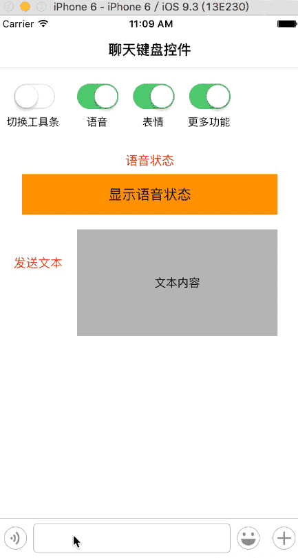

# KeyboardForChat
仿微信聊天键盘。  
优点：无污染，无任何第三方。  
      对表情键盘采用scrollView + collectionView 来做，有效的优化了表情模块。
      使用简单

交流 2581502433@qq.com

# 控件使用效果


# 控件使用步骤

## 添加数据源
```objc
    self.chatKeyBoard = [ChatKeyBoard keyBoard];
    self.chatKeyBoard.delegate = self;
    self.chatKeyBoard.dataSource = self;
    
    [self.view addSubview:self.chatKeyBoard];
```

## 实现数据源代理
```objc
- (NSArray<MoreItem *> *)chatKeyBoardMorePanelItems
{
    MoreItem *item1 = [MoreItem moreItemWithPicName:@"sharemore_location" highLightPicName:nil itemName:@"位置"];
    MoreItem *item2 = [MoreItem moreItemWithPicName:@"sharemore_pic" highLightPicName:nil itemName:@"图片"];
    MoreItem *item3 = [MoreItem moreItemWithPicName:@"sharemore_video" highLightPicName:nil itemName:@"拍照"];
    MoreItem *item4 = [MoreItem moreItemWithPicName:@"sharemore_location" highLightPicName:nil itemName:@"位置"];
    MoreItem *item5 = [MoreItem moreItemWithPicName:@"sharemore_pic" highLightPicName:nil itemName:@"图片"];
    MoreItem *item6 = [MoreItem moreItemWithPicName:@"sharemore_video" highLightPicName:nil itemName:@"拍照"];
    MoreItem *item7 = [MoreItem moreItemWithPicName:@"sharemore_location" highLightPicName:nil itemName:@"位置"];
    MoreItem *item8 = [MoreItem moreItemWithPicName:@"sharemore_pic" highLightPicName:nil itemName:@"图片"];
    MoreItem *item9 = [MoreItem moreItemWithPicName:@"sharemore_video" highLightPicName:nil itemName:@"拍照"];
    return @[item1, item2, item3, item4, item5, item6, item7, item8, item9];
}
- (NSArray<ChatToolBarItem *> *)chatKeyBoardToolbarItems
{
    ChatToolBarItem *item1 = [ChatToolBarItem barItemWithKind:kBarItemFace normal:@"face" high:@"face_HL" select:@"keyboard"];
    
    ChatToolBarItem *item2 = [ChatToolBarItem barItemWithKind:kBarItemVoice normal:@"voice" high:@"voice_HL" select:@"keyboard"];
    
    ChatToolBarItem *item3 = [ChatToolBarItem barItemWithKind:kBarItemMore normal:@"more_ios" high:@"more_ios_HL" select:nil];
    
    ChatToolBarItem *item4 = [ChatToolBarItem barItemWithKind:kBarItemSwitchBar normal:@"switchDown" high:nil select:nil];
    
    return @[item1, item2, item3, item4];
}

- (NSArray<FaceSubjectModel *> *)chatKeyBoardFacePanelSubjectItems
{
    return [FaceSourceManager loadFaceSource];
}
```

##控件可以根据业务需要，更换业务模型
`MoreItem`  
`ChatToolBarItem`  
`FaceSubjectModel`   
`FaceSourceManager`   

##感谢  
`MessageDisplayKit`
